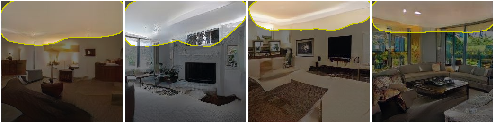
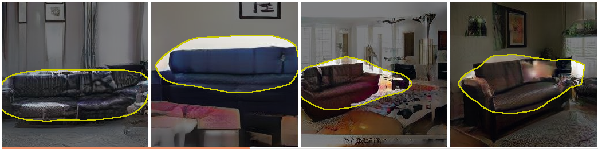
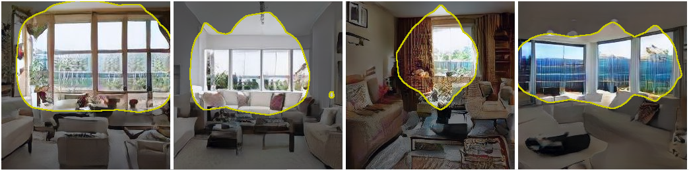
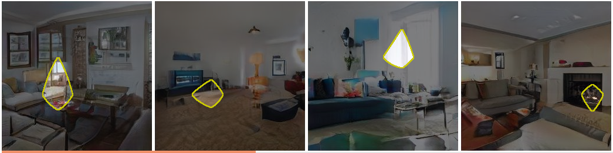
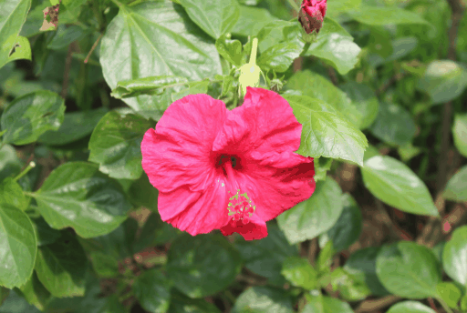

# homework3-GAN-Dissection

## 1. Generate images with GANPaint
|GANPaint|Before|After|
|--------|------|-----|
|**Example 1**|||
|**Example 2**|||
|**Example 3**|||

## 2. Dissect GAN model and analyze
We dissect our GAN model which is trained on LSUN livingroom dataset. Here we show some dissecting examples:

### Ceiling 

### Sofa

### Window

GAN dissection can automatically find the corresponding feature maps of certain labels. The area of yellow circles indicates that the feature maps are similar.

However, failures also happen frequently. We also show some failure case as the following figures:

### Chair

## 3. Compare with other method 

* [Globally and Locally Consistent Image Completion](https://github.com/satoshiiizuka/siggraph2017_inpainting) [method 1]

* [EdgeConnect: Generative Image Inpainting with Adversarial Edge Learning](https://github.com/knazeri/edge-connect) [method 2]

* [Generative Image Inpainting with Contextual Attention](https://github.com/JiahuiYu/generative_inpainting) [method 3]

We compare three generative inpaiting methods. For each image, we crop a rectangle and fill it with white color. For clearer visualization, we compress the results as gif animation. The display order is the original image, cropped image, and inpainted image, respectively.

In general, method 2 usually creates blurred result, while method 3 usually creates most photorealistic result. The three methods perform well on the grass(sample_2 and sample_3) and leaf(sample_5 ~ sample_7). On the other hand, the three methods are all failed in flower(sample_4). 

By the way, method 1 performs best on the cat(sample_1) example.

|Method|Globally and Locally Consistent Image Completion|EdgeConnect: Generative Image Inpainting with Adversarial Edge Learning|Generative Image Inpainting with Contextual Attention|
|-----------|------------|-----------|--------------|
|**Sample_1**||||
|**Sample_2**||||
|**Sample_3**||||
|**Sample_4**||||
|**Sample_5**||||
|**Sample_6**||||
|**Sample_7**||||
