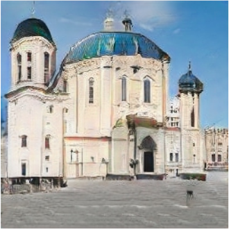
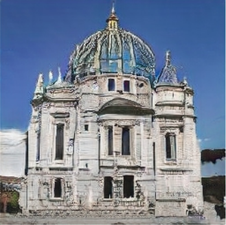
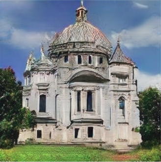
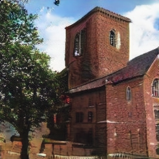
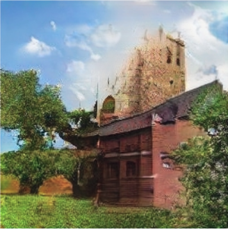
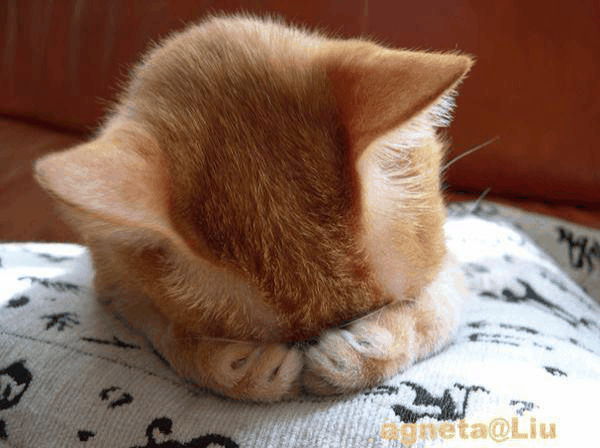
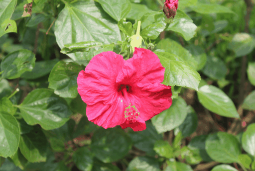

# homework3-GAN-Dissection

## Assign

1.  10% (Generate images with GANPaint)
2.  20% (Dissect any GAN model and analyze what you find)
3.  20% (Compare with other method)
4.  30% (Assistant) 
5.  20% (Mutual evaluation)

## 1. Generate images with GANPaint
|GANPaint|Before|After|
|--------|------|-----|
|**Example 1**|||
|**Example 2**|||
|**Example 3**|||

## 2. Dissect GAN model and analyze

## 3. Compare with other method 

# Globally and Locally Consistent Image Completion [method1]

# EdgeConnect: Generative Image Inpainting with Adversarial Edge Learning [method2]

# Generative Image Inpainting with Contextual Attention [method3]

|Method|Globally and Locally Consistent Image Completion|EdgeConnect: Generative Image Inpainting with Adversarial Edge Learning|Generative Image Inpainting with Contextual Attention|
|-----------|------------|-----------|--------------|
|**Sample 1**||||
|**Sample 2**||||
|**Sample 3**||||
|**Sample 4**||||
